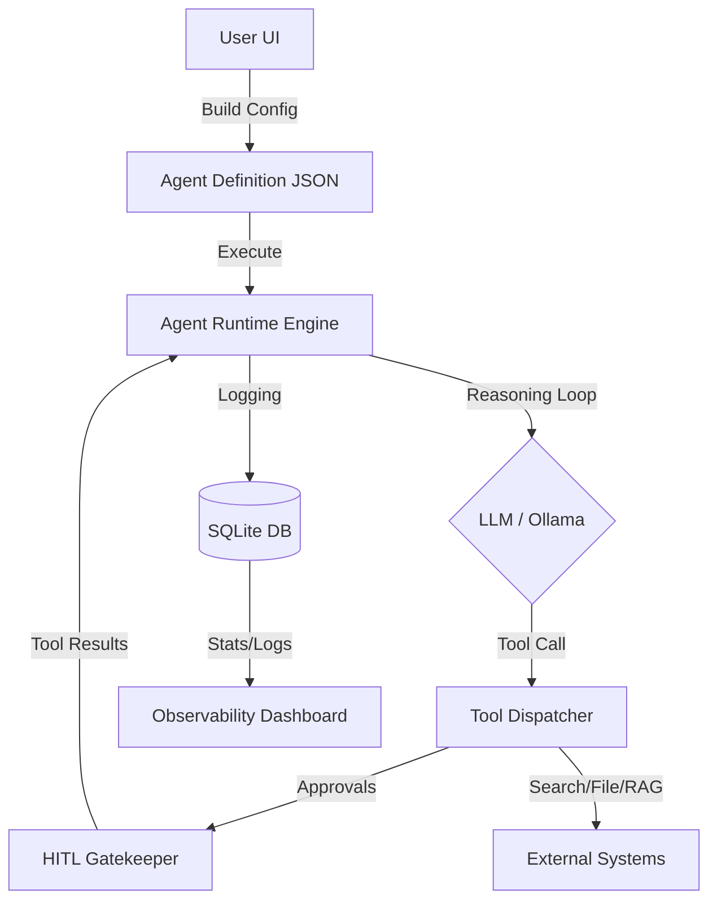

# 🏗️ AgentVendi Architecture Overview (v1.1)

AgentVendi is designed as a modular, event-driven agent orchestration framework. It consists of a high-fidelity frontend configuration builder and a robust backend execution runtime.

---

## 1. 📂 Core Architectural Layers

### **1.1 Layer 1: Agent Definition (The Config Builder)**
- **7-Step Wizard**: A structured workflow (Persona, Cognitive, Knowledge, Skills, Guardrails, Selection, Export) that generates a comprehensive JSON-based "Agent Definition."
- **Visual Flow Canvas**: Uses SVG and Canvas API to visualize how multiple agents "hand-off" to each other based on their defined roles.

### **1.2 Layer 2: Agent Runtime (The Execution Engine)**
- **ReAct Execution Loop**: Implements the "Reasoning and Acting" (ReAct) pattern. The engine parses the agent's thoughts into discrete "tool-use" requests, executes those tools, and feeds the output back into the context window.
- **Tool Ecosystem**: Native Node.js handlers for:
  - **Web Search**: Dynamic information retrieval.
  - **File Operations**: Controlled IO for agentic code generation and manipulation.
  - **RAG (Retrieval-Augmented Generation)**: Vector-lite search for knowledge base queries.
- **Agent Crews (Multi-Agent)**: Logic to manage turn-taking and context passing between specialized agents within a single run.

### **1.3 Layer 3: Observability & AgOps (The Monitoring Dashboard)**
- **SQL Persistence**: All runs are stored in `agent_runs` for historical analysis.
- **Execution Logs**: Detailed `agent_run_logs` track every thought, tool call, and result.
- **Cost Analytics**: Built-in logic to estimate token counts and dollar-value cost per run.
- **Time-Travel Debugger**: Interactive log editing allowing developers to "rewrite history" by modifying an assistant message and re-running the agent from that specific turn.

### **1.4 Layer 4: Safety & Security (Middleware)**
- **Human-in-the-loop (HITL)**: Sensitive tool calls (e.g., `delete_file`) trigger an `approvals` request in the database. The runtime pauses and polls for a user's manual approval or denial.
- **Prompt Injection Guardrails**: Regex-based scanners to detect and neutralize adversarial inputs.
- **Audit Logging**: Global middleware that tracks every HTTP request and status code in an `activity_log`.

---

## 2. 📊 High-Level Flow Diagram (Mermaid)

---

## 3. 💾 Data Model (SQLite Schema)

| Table | Purpose |
| --- | --- |
| `agents` | Core agent configuration and current version. |
| `agent_versions` | Historical snapshots of configurations for diffing. |
| `agent_runs` | Status, input/output, latency, and cost of an execution. |
| `agent_run_logs` | Turn-by-turn trace of an agent's reasoning-acting loop. |
| `approvals` | Pending manual approvals for sensitive tool calls. |
| `vector_docs` | Indexed knowledge segments for RAG retrieval. |
| `activity_log` | Security audit trail of all platform activities. |

---

## 4. 🚀 Scalability & Deployment
- **Dockerized**: Unified `docker-compose` for local hosting of the API and LLM engine.
- **Vendi Script**: Configurations are highly portable JSON assets that can be imported/exported into any instance.
- **Vending Machine API**: Exposes configured agents as stateless REST endpoints for external consumption.

---

**Last Updated:** April 2026 for AgentVendi release v1.1
