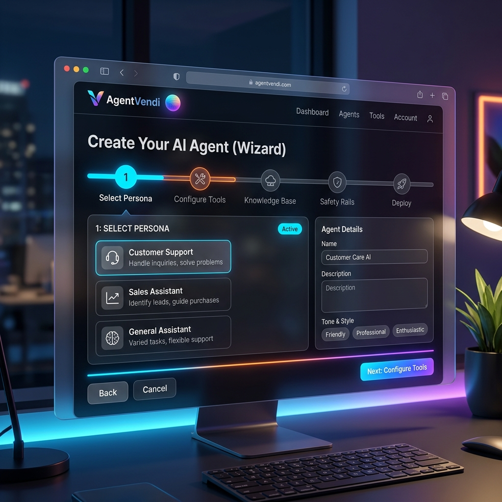
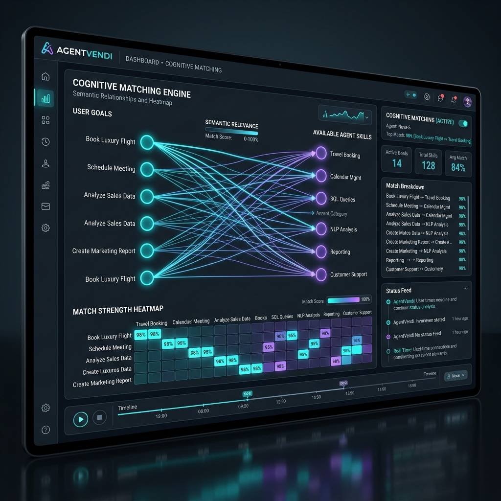
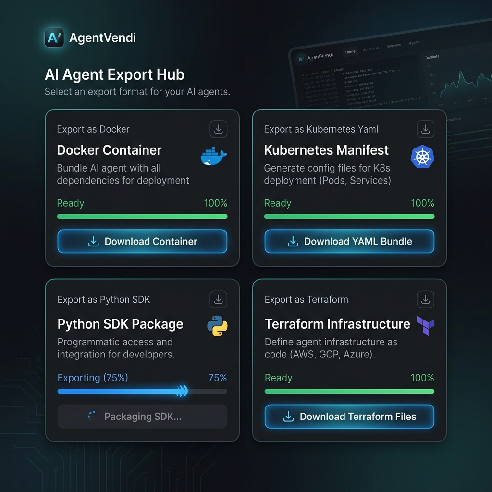
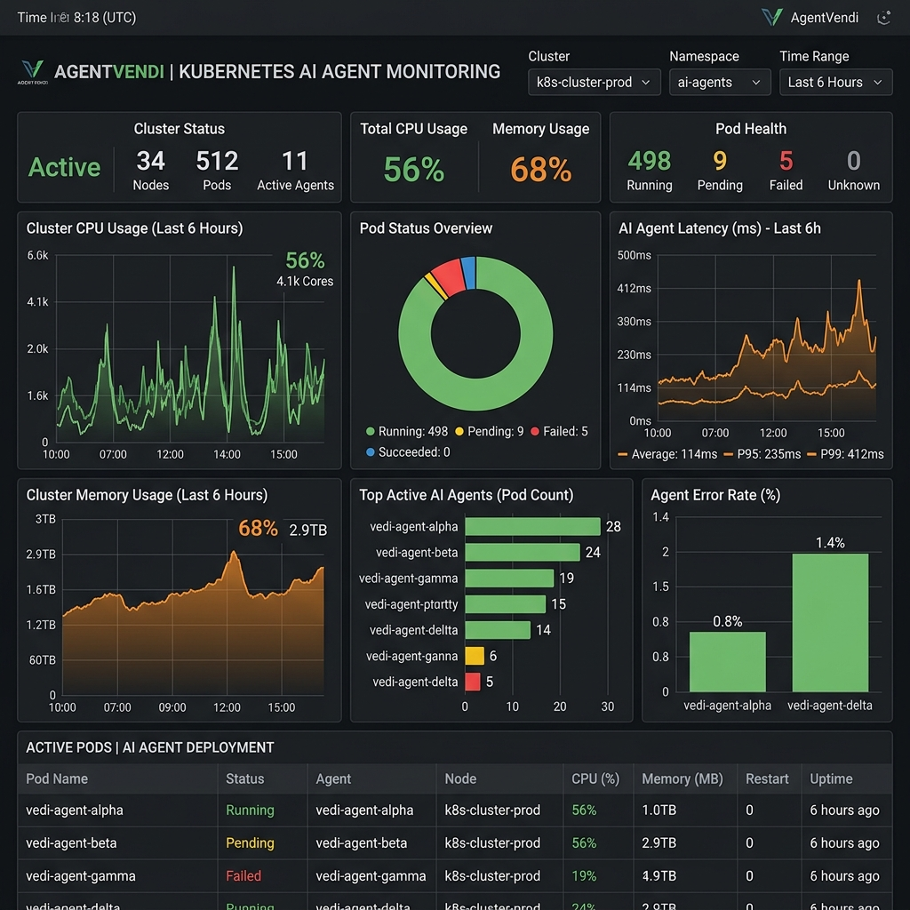
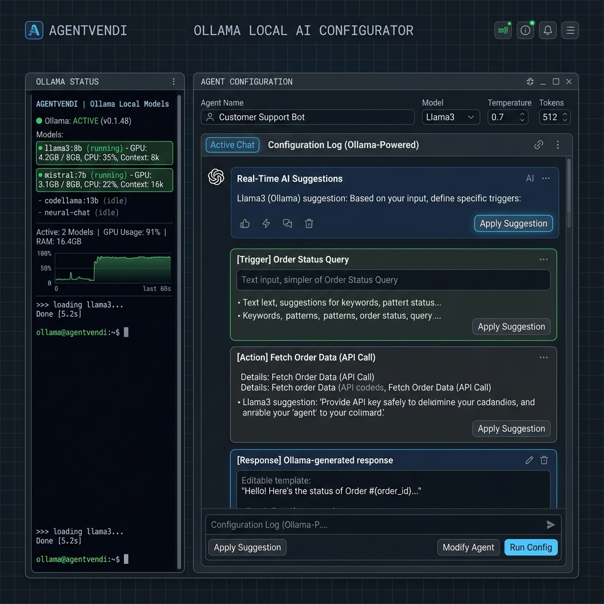
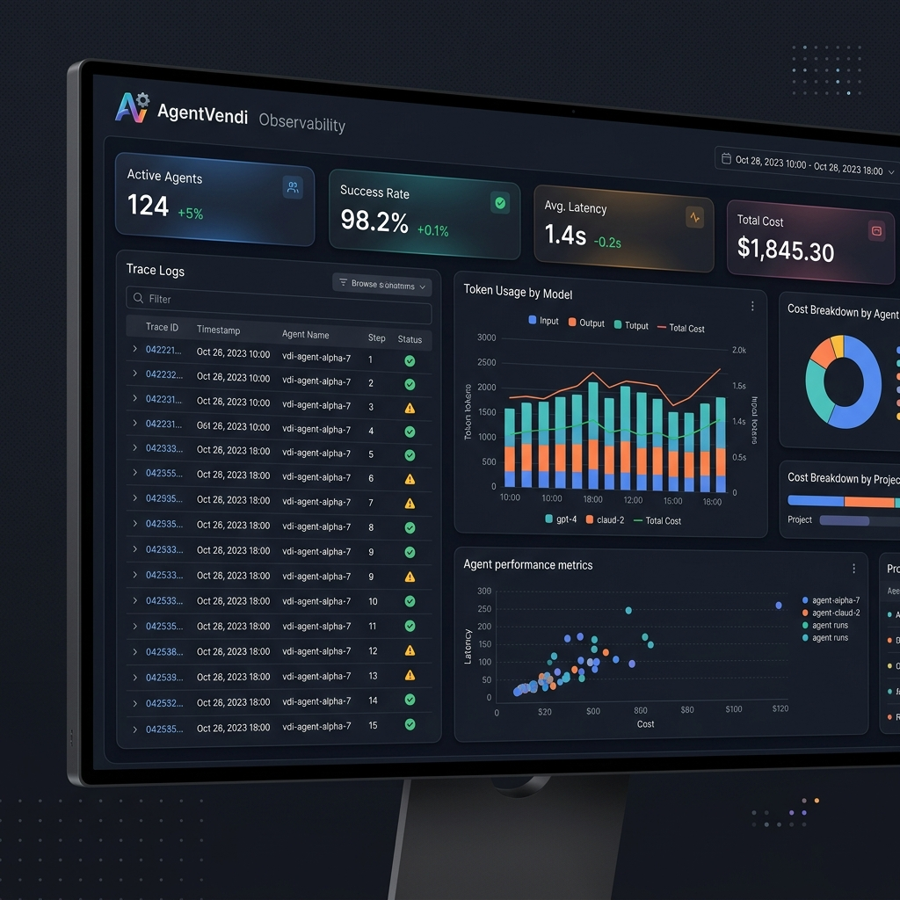
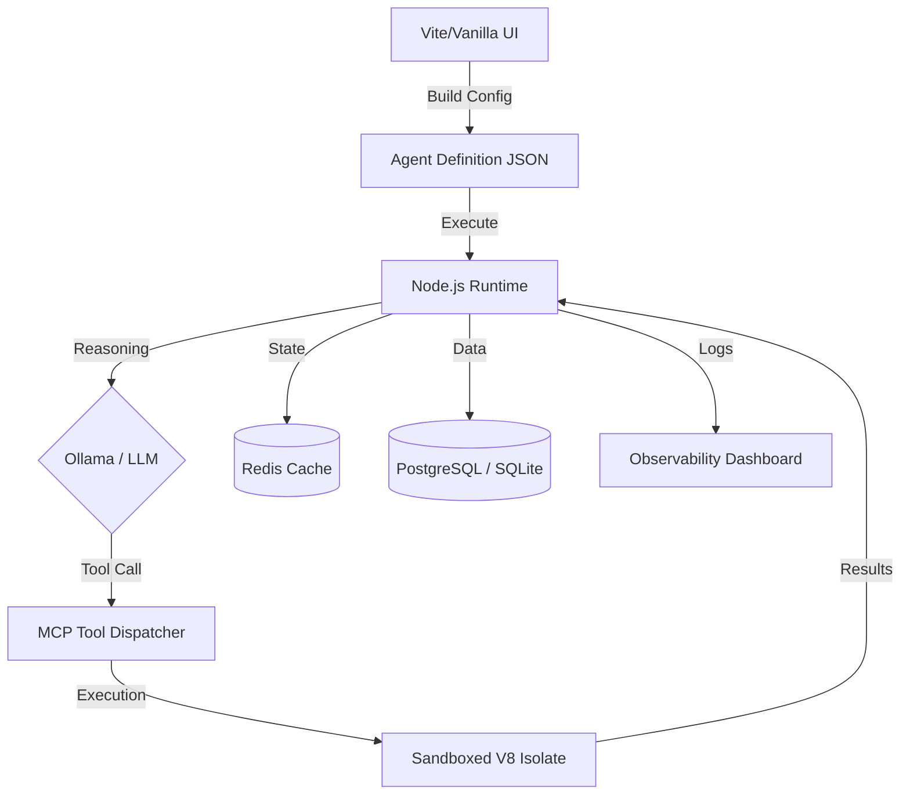

# 🎰 AgentVendi

[](https://opensource.org/licenses/MIT)
[](https://github.com/Santhoshnadella/agentvendiv1)
[](https://github.com/Santhoshnadella/agentvendiv1)
[](https://github.com/Santhoshnadella/agentvendiv1/coverage)

**The no-code vending machine for production-grade AI agents — local-first, enterprise-ready.**

AgentVendi is a powerhouse orchestration platform that transforms fragmented AI models into reliable, secure, and observable autonomous systems. Whether you are running Llama3 locally via Ollama or enterprise-scale clusters on Kubernetes, AgentVendi provides the "Agentic Operating System" you need to ship with confidence.

---

## 📸 Visual Tour

<p align="center">
  
  
</p>
<p align="center">
  <i>The 7-step Agent Creation Wizard and AI-assisted Cognitive Matching in action.</i>
</p>

<p align="center">
  
  
</p>
<p align="center">
  <i>Multi-format export options (Docker, K8s, SDK) and integrated infrastructure monitoring.</i>
</p>

<p align="center">
  
  
</p>
<p align="center">
  <i>Real-time local LLM suggestions and deep trace-level observability.</i>
</p>

---

## 🛠️ Tech Stack & Languages

AgentVendi is built with a modern, high-performance stack for local-first AI orchestration.

- **Languages**: TypeScript, JavaScript (ESM), SQL, HTML/CSS.
- **Backend**:
    - **Runtime**: Node.js (Express.js framework).
    - **Intelligence**: Ollama (Local LLMs), MCP SDK (Tool usage), Isolated-VM (Sandboxing).
    - **Persistence**: PostgreSQL (Primary), SQLite (Edge), Redis (State/Scaling).
    - **Reliability**: Zod (Validation), Winston (Logging), Playwright (Automation).
- **Frontend**:
    - **Build Tool**: Vite.
    - **UI Engine**: Vanilla TS/JS with ZUI components.
    - **Client AI**: Xenova Transformers (In-browser ML).
- **Infrastructure**: Docker, Kubernetes, GitHub Actions.

---

## 🏗️ Core Architecture



---

## 🚀 Why AgentVendi?

| Feature | **AgentVendi** | LangGraph | CrewAI | AutoGen |
| :--- | :--- | :--- | :--- | :--- |
| **No-Code UI** | ✅ Built-in Wizard | ❌ Code-first | ❌ Code-first | ❌ Code-first |
| **Security** | ✅ V8 Isolates | ❌ Host Process | ❌ Host Process | ❌ Host Process |
| **Deployment** | ✅ K8s / Docker / SDK | ❌ SDK Only | ❌ SDK Only | ❌ SDK Only |
| **Local LLMs** | ✅ Native Ollama | ⚠️ Manual | ⚠️ Manual | ⚠️ Manual |
| **Observability** | ✅ Time-Travel Debug | ⚠️ Limited | ⚠️ Limited | ⚠️ Limited |

---

## ⚡ Quickstart (< 60 seconds)

### 1. Clone & Install
```bash
git clone https://github.com/Santhoshnadella/agentvendiv1.git
cd agentvendiv1
npm install
```

### 2. Configure Environment & Data
```bash
cp .env.example .env
# Setup schemas (Postgres or SQLite)
npm run migrate
```

### 3. Launch the Machine
```bash
# Starts both Frontend and Backend
npm run dev
```
Visit `http://localhost:3000` to start building!

---

## 🛠️ Key Capabilities

- **Hardened Sandboxing**: Run 3rd-party agent skills in secure V8 isolates with zero risk to host infrastructure.
- **Cognitive Matching**: Semantic skill suggestions powered by Transformers.js (local-first).
- **Time-Travel Debugger**: Snapshot, fork, and replay agent runs to fix reasoning errors instantly.
- **Enterprise-Ready**: Native support for Redis-backed state, k8s dashboards, and RBAC settings.

---

## 🗺️ Roadmap

- [x] **v1.0.0**: Core Vending Machine, Wizard UI, and Local LLM support.
- [x] **v1.1.0**: Redis-backed horizontal scaling, pgvector support, and Zod security hardening.
- [ ] **v1.2.0** (Q3 2026): Multi-agent Swarm clusters & Cross-platform sync.
- [ ] **v2.0.0** (Q4 2026): Enterprise SSO, Advanced Audit Logs, and Managed Cloud.

---

## 🤝 Community & Signal

- **License**: [MIT](LICENSE)
- **Code of Conduct**: [CODE_OF_CONDUCT.md](CODE_OF_CONDUCT.md)
- **Contributing**: [CONTRIBUTING.md](CONTRIBUTING.md)
- **Pull Request Template**: [.github/pull_request_template.md](.github/pull_request_template.md)

---

<p align="center">
  Built with ❤️ by the AgentVendi Team. <br/>
  <i>Enterprise intelligence, orchestrated.</i>
</p>

<!-- GitHub Topics -->
<!-- ai-agents, agent-framework, local-llm, ollama, no-code-ai -->
